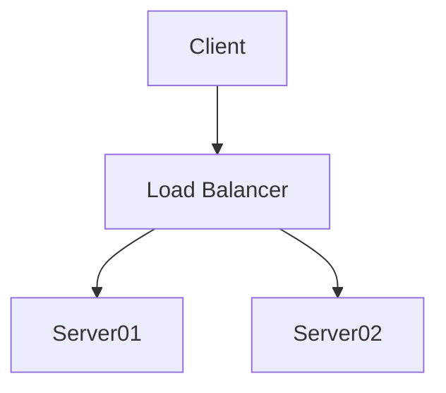

## Resources
- [Hacker theme GitHub(v0.2.0)](https://github.com/pages-themes/hacker/tree/v0.2.0)

## AI comments
- [GrokHistory](gnosis/ai_chat/GrokHistory.md)
- [GrokHistory2](gnosis/ai_chat/GrokHistory2.md)
- [GeminiHistory_Conception](gnosis/ai_chat/GeminiHistory_Conception.md)

## Test Mermaid Flowchart

This is a paragraph below flowchart.